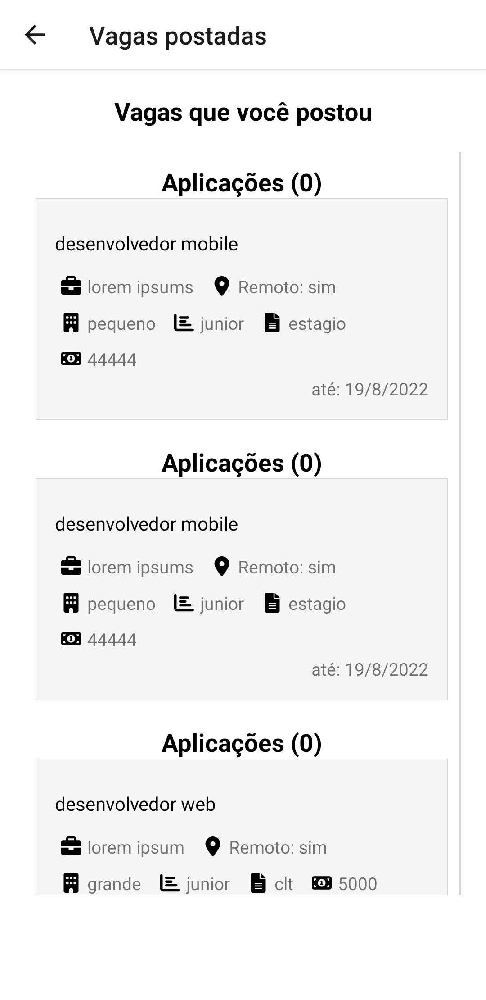

 "# react_native_app_jobs" 

App feito utilizando react native, typescript e redux

algumas libs

react navigation, stack e tab, fontawesome, axios, formik, image-crop-picker,

No app é possivel criar sua conta como usuario ou compania.

O usuario pode se registrar e ve suas aplicações. 
Enquanto o compania pode ver quantas pessoas aplicaram para cada vaga e quantas vagas foram postadas, ele também tem acesso a rota publish que permite fazer a publicação, a area de publicação, registro e login tem validação tanto no mobile quanto no back, se a vaga expirar ela aparece como vencida para ambos os tipos de registro. 

O user independente do tipo, tem acesso a rota dashboard onde pode gerenciar sua candidatura ou aplicação, ao clicar no header icon aparece um modal com opções de login out ou as opções anteriores, Quando necessario a pagina tem um icone loading que espera a requisição no back ser concluida, em caso de algum problema pode ser redirecionado para pagina de error

O login ao ser feito é salvo em cache e em caso de problema na requisição, como id não existe ou token, ele é redirecionado e tem seu cache deletado, tudo é salvo via redux.

Ele também mostra na tela da vaga se você ja aplicou a ela ou se for compania você não tem autorização para aplicar, ao aplicar a informação é atualizada automaticamente, sendo visivel que você aplicou a ela.

Também é possivel trocar a foto do perfil cadastrado salvo no backend, alem de editar outras informações com validadores como se email ja existe, senha esta correta, etc  

É possivel também filtrar a vaga pela tech, tipo de contrato, remoto, etc

** lista de techs é gerada com um arquivo auxiliar, não é gerado com base na quantidade de tech inserida 
Em src -> utils > routesPatch necessario colocar seu ip no enums SERVER para rodar 

Para rodar basta baixar as dependencias e rodar com seu android ou ios 

 

 
 
 
  
 
 
 
 
  
  
  
  

 
 

 
 

